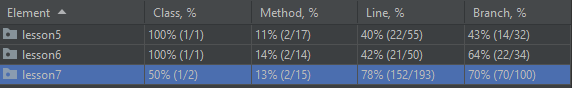
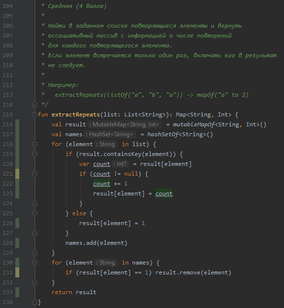
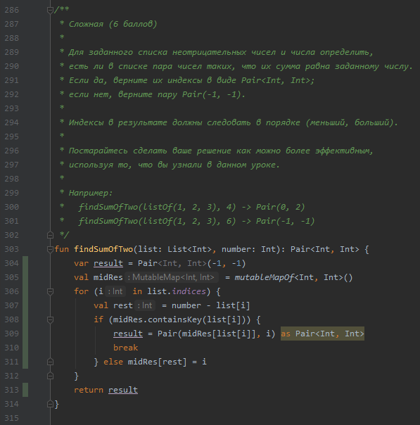
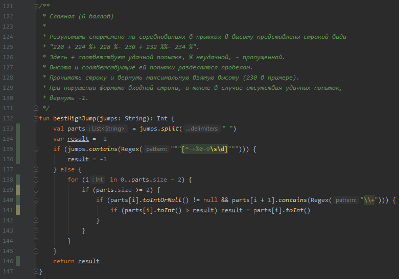
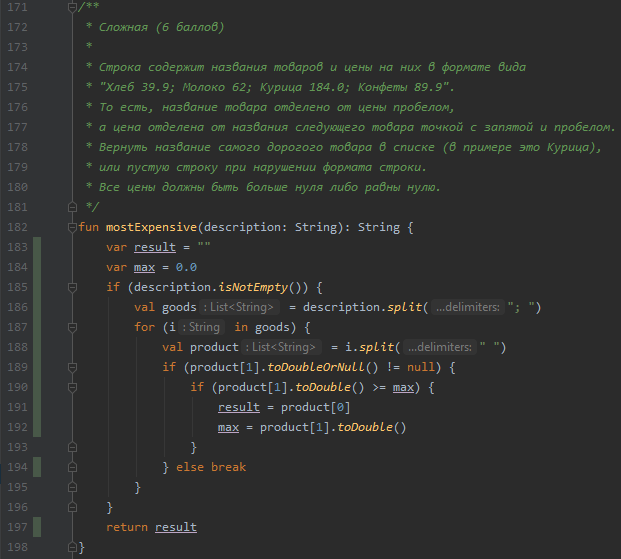
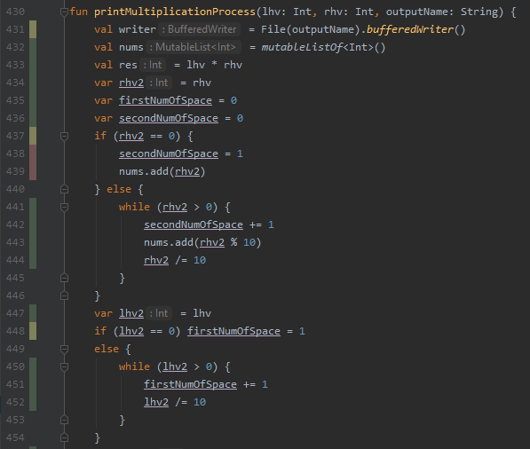
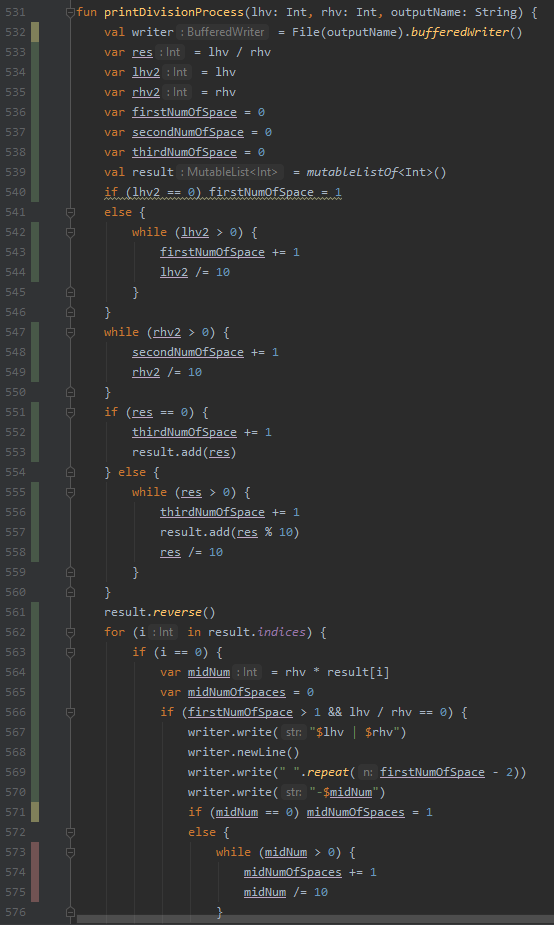

#Отчет по лабораторной работе №3

Как можно увидеть, покрытие оставляет желать лучшего. Это связано с тем, что студентом реализовано только по 2 метода 
для каждого урока, а все остальные просто закрыты "заглушками"
Посмотрим подробнее на каждый Lesson:

##Lesson5

Посмотрим на покрытие метода extractRepeats. Наши тесты покрывают почти все строки, за исключенимем 2-х условий, которые помечены желтым.
Jacoco выделяет желтым те условия, которые выполнены только один раз, т.е. это значит, что условие всегда true/false

Теперь посмотрим на метод findSumOfTwo. Как можно увидеть, код метода полностью покрыт тестами

Для улучшения покрытия метода extractRepeats стоит написать еще нескоько тестов, чтобы каждая строка была покрыта.
##Lesson6

Посмотрим на покрытие метода bestHighJump. Как можно увидеть, здесь аналогичная ситуация, как и с extractRepeats, т.е. 2 условия 
всегда либо true, либо false

Теперь посмотрим на метод mostExpensive. Код метода полностью покрыт тестами

Для метода bestHighJump совет аналогичен прошлому методу: написание большего количества тестов, при которых условие бы поменяло свое значение.

##Lesson7

Посмотрим на покрытие метода printMultiplicationProcess. В данном методе уже есть участки кода, которые полностью не покрыты. 
Для исправления этого нужно написать дополнительный тест, который будет в качестве второго числа подавать на вход метода 0.

Теперь посмотрим на метод printDivisionProcess. Здесь аналогично есть непокрытый участок. 

##Выводы

Если смотреть только на начальные значения покрытия кода, то у нас все плохо, т.к. покрыты только по 2 метода из 14-17.
Но если посмотреть на покрытие реализованных методов, то получается все не так плачевно. В lesson5-6 мы имеем почти полное 
покрытие кода тестами, с небольшими проблемами с условиями, которые не меняют свое значение.

Но вот в lesson7 мы уже имеем фрагменты кода, которые полностью не покрыты. Для решения данной проблемы стоит дописать еще 
некоторое количество тестов.